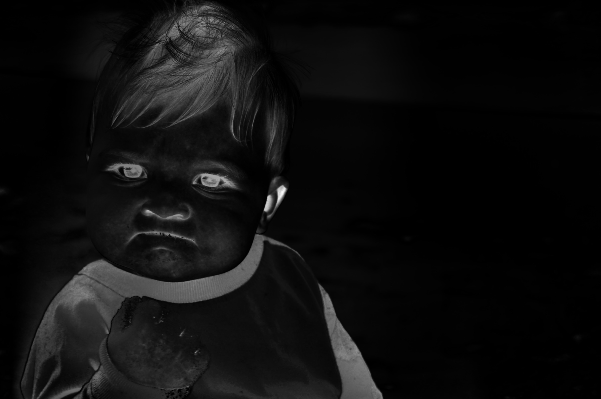
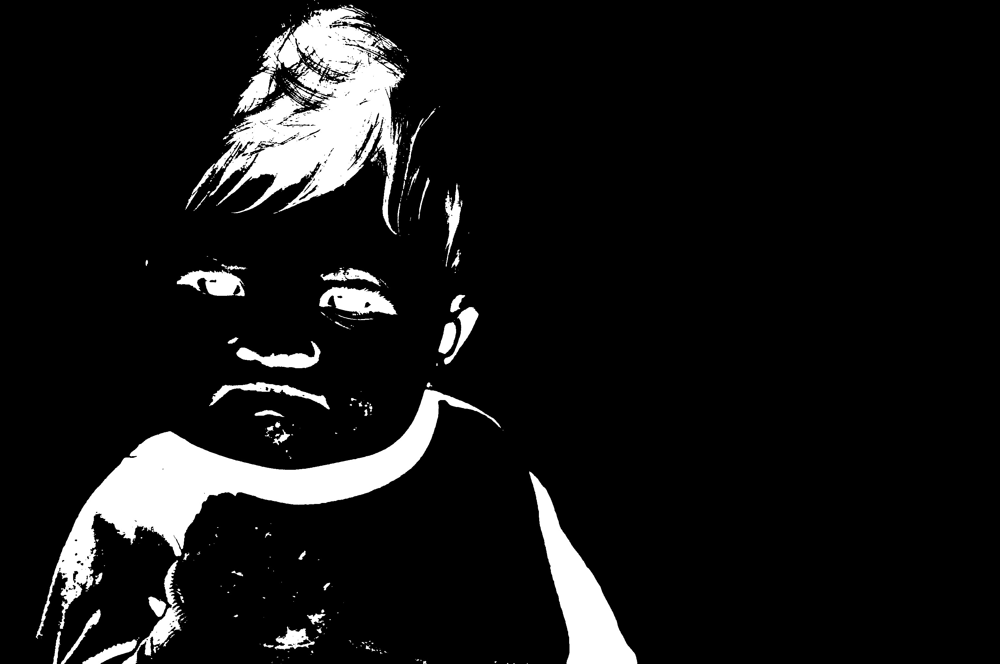

# MSS-saliency

Regions of Interest Maximum Symmetric Surround Saliency Algorithm.

Demo images for `SaliencyDetector` (cli tool of [mss-saliency](https://github.com/ImageProcessing-ElectronicPublications/mss-saliency)).

## Demo

**Success Meme Baby**

Let's look at the famous "Success!" baby photo as a quick demo of our saliency detector.

**Success Meme Baby, saliency mapped**

This is the native output of MSSS.

**Success Meme Baby, salient two colors**

Here we used the inbuilt --threshold switch to reduce the saliency map to only 2-color black and white pixels, which makes the salient regions very easy to detect programmatically.

Note how the saliency detector has successfully ignored the background as well as monotone areas in the foreground so that only detailed, multicolored areas stay as parts of the regions of interest. This way, processes like adaptive compression have an awesome basis to operate on.
